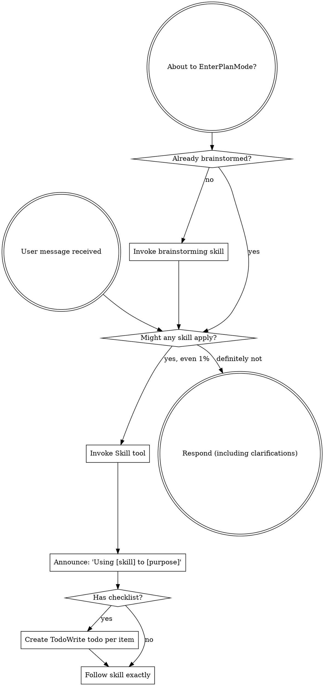

Reading additional input from stdin...
OpenAI Codex v0.135.0
--------
workdir: C:\Repo\ufdr-analyzer
model: gpt-5.5
provider: openai
approval: never
sandbox: read-only
reasoning effort: xhigh
reasoning summaries: none
session id: 019ea7e0-675c-7281-9f7a-3c2967d92697
--------
user
review this diff as a senior engineer with no patience for excuses. This is a forensic tool adding (1) temporal anomaly detection over message/call timelines and (2) a cross-case entity-linking index that stores SALTED HASHES of phone numbers/emails. Find statistical-correctness bugs (spike/dropoff/change-point math), determinism holes, privacy leaks in the hash index, injection, edge cases (empty/single-day/timezone), naming smell, dead code. Be brutal. No praise.

<stdin>
diff --git a/backend/db_setup.py b/backend/db_setup.py
index 84f63d2..245e83c 100644
--- a/backend/db_setup.py
+++ b/backend/db_setup.py
@@ -136,6 +136,25 @@ class AuditEvent(SQLModel, table=True):
     entry_hash: str = Field(default="", index=True)  # sha256 over prev_hash + canonical fields
 
 
+class EntityIndex(SQLModel, table=True):
+    """Cross-case identifier index — PII-minimized.
+
+    One row per (run, identifier) recording only a SALTED HASH of the normalized
+    identifier (phone/email), never the raw value. This lets us answer "does this
+    number appear in other cases?" by matching hashes across runs, without
+    duplicating raw personal data into a shared index. The matching identifier is
+    always supplied by the querying case, so no other case's PII is revealed.
+    """
+    id: Optional[uuid.UUID] = Field(
+        default_factory=uuid.uuid4, primary_key=True)
+    run_id: uuid.UUID = Field(index=True)
+    identifier_hash: str = Field(index=True)  # salted sha256 of normalized identifier
+    identifier_type: str  # "phone" | "email"
+    first_seen: Optional[datetime.datetime] = Field(default=None)
+    last_seen: Optional[datetime.datetime] = Field(default=None)
+    occurrence_count: int = 0
+
+
 class Message(SQLModel, table=True):
     """Represents a message from UFDR data."""
     id: Optional[uuid.UUID] = Field(
diff --git a/backend/ingest/routers/analytics_router.py b/backend/ingest/routers/analytics_router.py
new file mode 100644
index 0000000..3d69309
--- /dev/null
+++ b/backend/ingest/routers/analytics_router.py
@@ -0,0 +1,18 @@
+"""Temporal patterns / anomaly endpoints."""
+import uuid
+
+from fastapi import APIRouter, Depends, Query
+from sqlmodel import Session
+
+from database import get_session
+from ingest.services.analytics_service import AnalyticsService
+
+router = APIRouter(prefix="/analytics", tags=["Temporal Patterns"])
+
+
+@router.get("/patterns")
+def patterns(run_id: uuid.UUID = Query(...), session: Session = Depends(get_session)) -> dict:
+    """Behavioural findings (spikes, late-night, drop-off, bursts, new contacts)
+    over a run's message + call timeline, each backed by event citations, plus a
+    deterministic English narrative."""
+    return AnalyticsService(session).analyze(run_id).to_dict()
diff --git a/backend/ingest/routers/cross_case_router.py b/backend/ingest/routers/cross_case_router.py
new file mode 100644
index 0000000..f45b95e
--- /dev/null
+++ b/backend/ingest/routers/cross_case_router.py
@@ -0,0 +1,43 @@
+"""Cross-case entity-linking endpoints (PII-minimized salted-hash index)."""
+import uuid
+
+from fastapi import APIRouter, Depends, Query
+from sqlmodel import Session
+
+from database import get_session
+from ingest.services.cross_case_service import CrossCaseService
+
+router = APIRouter(prefix="/cross-case", tags=["Cross-Case Linking"])
+
+
+@router.post("/index")
+def index_run(run_id: uuid.UUID = Query(...), session: Session = Depends(get_session)) -> dict:
+    """Build/refresh the cross-case identifier index for a run."""
+    count = CrossCaseService(session).index_run(run_id)
+    return {"run_id": str(run_id), "indexed_identifiers": count}
+
+
+@router.get("/links")
+def links(run_id: uuid.UUID = Query(...), session: Session = Depends(get_session)) -> dict:
+    """Identifiers in this run that also appear in other indexed cases."""
+    found = CrossCaseService(session).links_for_run(run_id)
+    return {
+        "run_id": str(run_id),
+        "link_count": len(found),
+        "links": [
+            {
+                "identifier": l.identifier,
+                "identifier_type": l.identifier_type,
+                "also_in_runs": l.also_in_runs,
+                "case_count": l.case_count,
+            }
+            for l in found
+        ],
+    }
+
+
+@router.get("/lookup")
+def lookup(identifier: str = Query(..., description="phone number or email"),
+           session: Session = Depends(get_session)) -> dict:
+    """Which cases contain this identifier (matched by salted hash)?"""
+    return CrossCaseService(session).lookup(identifier)
diff --git a/backend/ingest/services/analytics_service.py b/backend/ingest/services/analytics_service.py
new file mode 100644
index 0000000..16170b0
--- /dev/null
+++ b/backend/ingest/services/analytics_service.py
@@ -0,0 +1,342 @@
+"""Temporal pattern & anomaly detection over a run's communications.
+
+An investigator does not want a thousand rows — they want "what changed, and
+when". This service derives behavioural findings from message + call timestamps:
+volume spikes, late-night activity, communication cessation/drop-off, sustained
+bursts, and the sudden emergence of a new contact. Every finding is **cited**:
+it carries the ids of the underlying events, so a claim like "activity ceased
+after 2024-03-04" is traceable to the rows that prove it.
+
+Pure and deterministic — same data in, same findings out (thresholds are fixed
+constants, outputs are sorted). Testable on SQLite; no heavy deps, no LLM.
+A separate deterministic narrator turns the findings into one English paragraph.
+"""
+from __future__ import annotations
+
+import statistics
+from collections import defaultdict
+from dataclasses import dataclass, field
+from datetime import date, datetime, timedelta
+
+from sqlmodel import Session, select
+
+from db_setup import Call, Message
+
+# Detection thresholds — explicit so the output is reproducible and explainable.
+_SPIKE_Z = 2.0            # std-devs above mean daily volume to call a "spike"
+_SPIKE_MIN_EVENTS = 5     # ignore spikes below this absolute volume
+_LATE_NIGHT_START = 0     # hours [0,5) are "late night"
+_LATE_NIGHT_END = 5
+_LATE_NIGHT_RATIO = 0.25  # flag if >= 25% of events are late-night
+_LATE_NIGHT_MIN = 6       # ...and there are at least this many late-night events
+_CESSATION_GAP_DAYS = 14  # trailing silence (vs span end) that counts as cessation
+_DROP_WINDOW = 7          # days each side of a change-point
+_DROP_RATIO = 0.6         # >= 60% relative drop after a change-point
+_BURST_MIN_DAYS = 3       # consecutive above-mean days to be a "burst"
+_EMERGENCE_MIN_EVENTS = 8 # new contact must reach this volume to be notable
+_MAX_CITATIONS = 25
+
+
+@dataclass
+class Citation:
+    source_table: str
+    row_id: str
+
+
+@dataclass
+class Finding:
+    type: str           # spike | late_night | cessation | drop | burst | new_contact
+    severity: str       # low | medium | high
+    title: str
+    description: str
+    dates: list[str] = field(default_factory=list)
+    stats: dict = field(default_factory=dict)
+    citations: list[Citation] = field(default_factory=list)
+
+
+@dataclass
+class _Event:
+    kind: str   # "message" | "call"
+    id: str
+    ts: datetime
+    a: str | None
+    b: str | None
+
+
+@dataclass
+class PatternReport:
+    run_id: str
+    span_start: str | None
+    span_end: str | None
+    total_events: int
+    daily_series: list[dict]
+    findings: list[Finding]
+    narrative: str
+
+    def to_dict(self) -> dict:
+        return {
+            "run_id": self.run_id,
+            "span_start": self.span_start,
+            "span_end": self.span_end,
+            "total_events": self.total_events,
+            "daily_series": self.daily_series,
+            "findings": [
+                {
+                    "type": f.type, "severity": f.severity, "title": f.title,
+                    "description": f.description, "dates": f.dates, "stats": f.stats,
+                    "citations": [c.__dict__ for c in f.citations],
+                }
+                for f in self.findings
+            ],
+            "narrative": self.narrative,
+        }
+
+
+class AnalyticsService:
+    def __init__(self, session: Session):
+        self.session = session
+
+    def _load_events(self, run_id) -> list[_Event]:
+        events: list[_Event] = []
+        for m in self.session.exec(select(Message).where(Message.run_id == run_id)).all():
+            if m.timestamp is not None:
+                events.append(_Event("message", str(m.id), m.timestamp, m.sender, m.receiver))
+        for c in self.session.exec(select(Call).where(Call.run_id == run_id)).all():
+            if c.timestamp is not None:
+                events.append(_Event("call", str(c.id), c.timestamp, c.caller, c.receiver))
+        events.sort(key=lambda e: (e.ts, e.kind, e.id))
+        return events
+
+    def analyze(self, run_id) -> PatternReport:
+        events = self._load_events(run_id)
+        if not events:
+            return PatternReport(str(run_id), None, None, 0, [], [],
+                                 "No communication activity was found for this run.")
+
+        by_day: dict[date, list[_Event]] = defaultdict(list)
+        for e in events:
+            by_day[e.ts.date()].append(e)
+
+        span_start, span_end = events[0].ts.date(), events[-1].ts.date()
+        series = self._dense_series(by_day, span_start, span_end)
+
+        findings: list[Finding] = []
+        findings += self._spikes(by_day, series)
+        findings += self._late_night(events)
+        findings += self._cessation(events, span_end)
+        findings += self._drop(series, by_day)
+        findings += self._bursts(series, by_day)
+        findings += self._new_contacts(events, span_start)
+
+        # Stable ordering: severity desc, then type, then first date.
+        sev_rank = {"high": 0, "medium": 1, "low": 2}
+        findings.sort(key=lambda f: (sev_rank.get(f.severity, 3), f.type, f.dates[:1]))
+
+        return PatternReport(
+            run_id=str(run_id),
+            span_start=span_start.isoformat(),
+            span_end=span_end.isoformat(),
+            total_events=len(events),
+            daily_series=[{"date": d.isoformat(), "messages": mc[0], "calls": mc[1],
+                           "total": mc[0] + mc[1]} for d, mc in series],
+            findings=findings,
+            narrative=narrate(findings, span_start, span_end, len(events)),
+        )
+
+    # -- detectors ---------------------------------------------------------
+    def _dense_series(self, by_day, start: date, end: date) -> list[tuple[date, tuple[int, int]]]:
+        out: list[tuple[date, tuple[int, int]]] = []
+        d = start
+        while d <= end:
+            evs = by_day.get(d, [])
+            msgs = sum(1 for e in evs if e.kind == "message")
+            calls = sum(1 for e in evs if e.kind == "call")
+            out.append((d, (msgs, calls)))
+            d += timedelta(days=1)
+        return out
+
+    def _spikes(self, by_day, series) -> list[Finding]:
+        totals = [m + c for _, (m, c) in series]
+        if len(totals) < 3:
+            return []
+        mean = statistics.fmean(totals)
+        std = statistics.pstdev(totals)
+        if std == 0:
+            return []
+        out: list[Finding] = []
+        for d, (m, c) in series:
+            vol = m + c
+            if vol < _SPIKE_MIN_EVENTS:
+                continue
+            z = (vol - mean) / std
+            if z >= _SPIKE_Z:
+                evs = by_day.get(d, [])
+                out.append(Finding(
+                    type="spike",
+                    severity="high" if z >= 3 else "medium",
+                    title=f"Communication spike on {d.isoformat()}",
+                    description=(f"{vol} events on {d.isoformat()} — {z:.1f}σ above the "
+                                f"daily mean of {mean:.1f}."),
+                    dates=[d.isoformat()],
+                    stats={"volume": vol, "z_score": round(z, 2),
+                           "daily_mean": round(mean, 2)},
+                    citations=[Citation(e.kind, e.id) for e in evs[:_MAX_CITATIONS]],
+                ))
+        return out
+
+    def _late_night(self, events) -> list[Finding]:
+        late = [e for e in events
+                if _LATE_NIGHT_START <= e.ts.hour < _LATE_NIGHT_END]
+        if len(late) < _LATE_NIGHT_MIN:
+            return []
+        ratio = len(late) / len(events)
+        if ratio < _LATE_NIGHT_RATIO:
+            return []
+        days = sorted({e.ts.date().isoformat() for e in late})
+        return [Finding(
+            type="late_night",
+            severity="medium",
+            title="Elevated late-night activity",
+            description=(f"{len(late)} of {len(events)} events ({ratio:.0%}) occurred "
+                         f"between 00:00–05:00 across {len(days)} day(s)."),
+            dates=days[:10],
+            stats={"late_night_events": len(late), "ratio": round(ratio, 3)},
+            citations=[Citation(e.kind, e.id) for e in late[:_MAX_CITATIONS]],
+        )]
+
+    def _cessation(self, events, span_end: date) -> list[Finding]:
+        last = events[-1].ts.date()
+        gap = (span_end - last).days
+        # span_end == last by construction, so detect cessation relative to the
+        # *bulk* end: find the last day carrying >=2 events and measure trailing gap.
+        active_days = sorted({e.ts.date() for e in events})
+        if len(active_days) < 3:
+            return []
+        last_active = active_days[-1]
+        # trailing silence between the penultimate burst and the true end:
+        gap = (last_active - active_days[-2]).days
+        if gap < _CESSATION_GAP_DAYS:
+            return []
+        return [Finding(
+            type="cessation",
+            severity="high",
+            title=f"Communication gap of {gap} days",
+            description=(f"After {active_days[-2].isoformat()} there was no activity for "
+                         f"{gap} days until {last_active.isoformat()} — a sustained break."),
+            dates=[active_days[-2].isoformat(), last_active.isoformat()],
+            stats={"gap_days": gap},
+            citations=[],
+        )]
+
+    def _drop(self, series, by_day) -> list[Finding]:
+        totals = [t for _, (m, c) in series for t in [m + c]]
+        n = len(totals)
+        if n < 2 * _DROP_WINDOW:
+            return []
+        out: list[Finding] = []
+        best = None
+        for i in range(_DROP_WINDOW, n - _DROP_WINDOW + 1):
+            before = statistics.fmean(totals[i - _DROP_WINDOW:i])
+            after = statistics.fmean(totals[i:i + _DROP_WINDOW])
+            if before <= 0:
+                continue
+            drop = (before - after) / before
+            if drop >= _DROP_RATIO and (best is None or drop > best[1]):
+                best = (i, drop, before, after)
+        if best:
+            i, drop, before, after = best
+            change_date = series[i][0]
+            out.append(Finding(
+                type="drop",
+                severity="high" if drop >= 0.8 else "medium",
+                title=f"Activity dropped {drop:.0%} after {change_date.isoformat()}",
+                description=(f"Daily volume fell from ~{before:.1f} to ~{after:.1f} "
+                            f"({drop:.0%}) around {change_date.isoformat()}."),
+                dates=[change_date.isoformat()],
+                stats={"before_mean": round(before, 2), "after_mean": round(after, 2),
+                       "drop_ratio": round(drop, 3)},
+                citations=[],
+            ))
+        return out
+
+    def _bursts(self, series, by_day) -> list[Finding]:
+        totals = [m + c for _, (m, c) in series]
+        if len(totals) < _BURST_MIN_DAYS:
+            return []
+        mean = statistics.fmean(totals)
+        if mean <= 0:
+            return []
+        out: list[Finding] = []
+        run_days: list[date] = []
+        for d, (m, c) in series:
+            if (m + c) > mean:
+                run_days.append(d)
+            else:
+                self._emit_burst(run_days, by_day, out)
+                run_days = []
+        self._emit_burst(run_days, by_day, out)
+        return out
+
+    def _emit_burst(self, run_days, by_day, out) -> None:
+        if len(run_days) < _BURST_MIN_DAYS:
+            return
+        evs = [e for d in run_days for e in by_day.get(d, [])]
+        out.append(Finding(
+            type="burst",
+            severity="low",
+            title=f"{len(run_days)}-day activity burst from {run_days[0].isoformat()}",
+            description=(f"Sustained above-average activity from {run_days[0].isoformat()} "
+                        f"to {run_days[-1].isoformat()} ({len(evs)} events)."),
+            dates=[run_days[0].isoformat(), run_days[-1].isoformat()],
+            stats={"days": len(run_days), "events": len(evs)},
+            citations=[Citation(e.kind, e.id) for e in evs[:_MAX_CITATIONS]],
+        ))
+
+    def _new_contacts(self, events, span_start: date) -> list[Finding]:
+        first_seen: dict[str, date] = {}
+        per_contact: dict[str, list[_Event]] = defaultdict(list)
+        for e in events:
+            for party in (e.a, e.b):
+                if not party:
+                    continue
+                per_contact[party].append(e)
+                if party not in first_seen or e.ts.date() < first_seen[party]:
+                    first_seen[party] = e.ts.date()
+        out: list[Finding] = []
+        for party, evs in sorted(per_contact.items()):
+            emerged = first_seen[party]
+            # "New" = first appears at least a week into the timeline, then active.
+            if (emerged - span_start).days >= 7 and len(evs) >= _EMERGENCE_MIN_EVENTS:
+                out.append(Finding(
+                    type="new_contact",
+                    severity="medium",
+                    title=f"New contact '{party}' emerged on {emerged.isoformat()}",
+                    description=(f"'{party}' first appears on {emerged.isoformat()} "
+                                f"({(emerged - span_start).days} days into the timeline) "
+                                f"with {len(evs)} subsequent events."),
+                    dates=[emerged.isoformat()],
+                    stats={"first_seen": emerged.isoformat(), "events": len(evs)},
+                    citations=[Citation(e.kind, e.id) for e in evs[:_MAX_CITATIONS]],
+                ))
+        return out
+
+
+def narrate(findings: list[Finding], span_start: date, span_end: date,
+            total_events: int) -> str:
+    """Deterministic English summary of the findings (no LLM required)."""
+    span_days = (span_end - span_start).days + 1
+    head = (f"Across {span_days} day(s) ({span_start.isoformat()} → "
+            f"{span_end.isoformat()}) the device shows {total_events} communication "
+            f"event(s).")
+    if not findings:
+        return head + " No notable temporal anomalies were detected."
+
+    high = [f for f in findings if f.severity == "high"]
+    parts: list[str] = [head]
+    if high:
+        parts.append("Most notably: " + "; ".join(f.title for f in high[:3]) + ".")
+    rest = [f for f in findings if f.severity != "high"]
+    if rest:
+        parts.append("Also flagged: " + "; ".join(f.title for f in rest[:4]) + ".")
+    parts.append("Each finding is backed by the underlying event citations.")
+    return " ".join(parts)
diff --git a/backend/ingest/services/cross_case_service.py b/backend/ingest/services/cross_case_service.py
new file mode 100644
index 0000000..98da9d0
--- /dev/null
+++ b/backend/ingest/services/cross_case_service.py
@@ -0,0 +1,141 @@
+"""Cross-case entity linking — "this number appears in N other cases".
+
+Single-case forensic tools can't answer the question investigators most want:
+*have I seen this person before?* This service builds a privacy-preserving index
+of identifiers (phone numbers, emails) across every ingested run, storing only a
+**salted hash** of each normalized identifier — never the raw value. Matching is
+then a hash join across runs, so a hit reveals only *that another case contains
+the same identifier you already hold*, not any other PII from that case.
+
+Deterministic given the salt; testable on SQLite. Normalization is explicit so
+"+1 (555) 010" and "+1555010" collapse to the same hash.
+"""
+from __future__ import annotations
+
+import hashlib
+import os
+import re
+from dataclasses import dataclass
+
+from sqlmodel import Session, delete, select
+
+from db_setup import Call, Contact, EntityIndex, Message
+
+# A salt prevents trivial rainbow-tabling of a small phone-number space. It is
+# config, not a credential; set CROSS_CASE_SALT to a shared secret for real
+# cross-organization linking. Default is documented and deterministic.
+_SALT = os.getenv("CROSS_CASE_SALT", "ufdr-cross-case-v1")
+
+_EMAIL_RE = re.compile(r"[^@\s]+@[^@\s]+\.[^@\s]+")
+_DIGITS_RE = re.compile(r"\d")
+
+
+def normalize(identifier: str) -> tuple[str, str] | None:
+    """Return (normalized_value, type) or None if not a usable identifier."""
+    if not identifier:
+        return None
+    s = identifier.strip()
+    if _EMAIL_RE.fullmatch(s):
+        return s.lower(), "email"
+    # Phone: keep a leading '+' and the digits; require >= 6 digits.
+    digits = "".join(_DIGITS_RE.findall(s))
+    if len(digits) >= 6:
+        plus = "+" if s.lstrip().startswith("+") else ""
+        return plus + digits, "phone"
+    return None
+
+
+def hash_identifier(identifier: str) -> str | None:
+    norm = normalize(identifier)
+    if norm is None:
+        return None
+    value, _type = norm
+    return hashlib.sha256((_SALT + "|" + value).encode("utf-8")).hexdigest()
+
+
+@dataclass
+class RunLink:
+    identifier: str            # the querying run's OWN raw identifier (already held)
+    identifier_type: str
+    identifier_hash: str
+    also_in_runs: list[str]    # other run ids sharing this identifier
+    case_count: int            # number of distinct runs (incl. this one)
+
+
+class CrossCaseService:
+    def __init__(self, session: Session):
+        self.session = session
+
+    def _identifiers_for_run(self, run_id) -> dict[str, tuple[str, str]]:
+        """hash -> (raw_example, type) for every identifier appearing in a run."""
+        out: dict[str, tuple[str, str]] = {}
+        sources: list[str] = []
+        for c in self.session.exec(select(Contact).where(Contact.run_id == run_id)).all():
+            sources.append(c.number)
+        for m in self.session.exec(select(Message).where(Message.run_id == run_id)).all():
+            sources += [m.sender, m.receiver]
+        for c in self.session.exec(select(Call).where(Call.run_id == run_id)).all():
+            sources += [c.caller, c.receiver]
+        for raw in sources:
+            if not raw:
+                continue
+            norm = normalize(raw)
+            if norm is None:
+                continue
+            value, vtype = norm
+            h = hashlib.sha256((_SALT + "|" + value).encode("utf-8")).hexdigest()
+            out.setdefault(h, (raw, vtype))
+        return out
+
+    def index_run(self, run_id) -> int:
+        """(Re)build the cross-case index rows for a run. Returns row count."""
+        self.session.exec(delete(EntityIndex).where(EntityIndex.run_id == run_id))
+        idents = self._identifiers_for_run(run_id)
+        rows = [
+            EntityIndex(run_id=run_id, identifier_hash=h, identifier_type=vtype,
+                        occurrence_count=1)
+            for h, (_raw, vtype) in idents.items()
+        ]
+        self.session.add_all(rows)
+        self.session.commit()
+        return len(rows)
+
+    def links_for_run(self, run_id) -> list[RunLink]:
+        """Identifiers in this run that also appear in other indexed runs."""
+        idents = self._identifiers_for_run(run_id)
+        if not idents:
+            return []
+        hashes = list(idents)
+        rows = self.session.exec(
+            select(EntityIndex).where(EntityIndex.identifier_hash.in_(hashes))
+        ).all()
+        by_hash: dict[str, set] = {}
+        for r in rows:
+            by_hash.setdefault(r.identifier_hash, set()).add(str(r.run_id))
+
+        links: list[RunLink] = []
+        for h, (raw, vtype) in sorted(idents.items(), key=lambda kv: kv[1][0]):
+            run_set = by_hash.get(h, set())
+            others = sorted(run_set - {str(run_id)})
+            if others:  # only surface genuine cross-case hits
+                links.append(RunLink(
+                    identifier=raw, identifier_type=vtype, identifier_hash=h,
+                    also_in_runs=others, case_count=len(run_set | {str(run_id)}),
+                ))
+        return links
+
+    def lookup(self, identifier: str) -> dict:
+        """Which runs contain this identifier (by salted hash)?"""
+        h = hash_identifier(identifier)
+        if h is None:
+            return {"identifier": identifier, "normalized": None, "runs": [], "count": 0}
+        rows = self.session.exec(
+            select(EntityIndex).where(EntityIndex.identifier_hash == h)
+        ).all()
+        runs = sorted({str(r.run_id) for r in rows})
+        return {
+            "identifier": identifier,
+            "identifier_hash": h,
+            "runs": runs,
+            "count": len(runs),
+        }
</stdin>
hook: SessionStart
hook: SessionStart Failed
codex
Using `superpowers:using-superpowers` because the session instructions require it before responding. I’ll keep this in code-review mode and focus on concrete defects in the supplied diff.
exec
"C:\\Users\\Aayushman\\AppData\\Local\\Microsoft\\WindowsApps\\pwsh.exe" -Command "Get-Content -Path 'C:/Users/Aayushman/.codex/plugins/cache/claude-plugins-official/superpowers/5.1.0/skills/using-superpowers/SKILL.md' -TotalCount 220" in C:\Repo\ufdr-analyzer
 succeeded in 507ms:
---
name: using-superpowers
description: Use when starting any conversation - establishes how to find and use skills, requiring Skill tool invocation before ANY response including clarifying questions
---

<SUBAGENT-STOP>
If you were dispatched as a subagent to execute a specific task, skip this skill.
</SUBAGENT-STOP>

<EXTREMELY-IMPORTANT>
If you think there is even a 1% chance a skill might apply to what you are doing, you ABSOLUTELY MUST invoke the skill.

IF A SKILL APPLIES TO YOUR TASK, YOU DO NOT HAVE A CHOICE. YOU MUST USE IT.

This is not negotiable. This is not optional. You cannot rationalize your way out of this.
</EXTREMELY-IMPORTANT>

## Instruction Priority

Superpowers skills override default system prompt behavior, but **user instructions always take precedence**:

1. **User's explicit instructions** (CLAUDE.md, GEMINI.md, AGENTS.md, direct requests) — highest priority
2. **Superpowers skills** — override default system behavior where they conflict
3. **Default system prompt** — lowest priority

If CLAUDE.md, GEMINI.md, or AGENTS.md says "don't use TDD" and a skill says "always use TDD," follow the user's instructions. The user is in control.

## How to Access Skills

**In Claude Code:** Use the `Skill` tool. When you invoke a skill, its content is loaded and presented to you—follow it directly. Never use the Read tool on skill files.

**In Copilot CLI:** Use the `skill` tool. Skills are auto-discovered from installed plugins. The `skill` tool works the same as Claude Code's `Skill` tool.

**In Gemini CLI:** Skills activate via the `activate_skill` tool. Gemini loads skill metadata at session start and activates the full content on demand.

**In other environments:** Check your platform's documentation for how skills are loaded.

## Platform Adaptation

Skills use Claude Code tool names. Non-CC platforms: see `references/copilot-tools.md` (Copilot CLI), `references/codex-tools.md` (Codex) for tool equivalents. Gemini CLI users get the tool mapping loaded automatically via GEMINI.md.

# Using Skills

## The Rule

**Invoke relevant or requested skills BEFORE any response or action.** Even a 1% chance a skill might apply means that you should invoke the skill to check. If an invoked skill turns out to be wrong for the situation, you don't need to use it.

## Red Flags

These thoughts mean STOP—you're rationalizing:

| Thought | Reality |
|---------|---------|
| "This is just a simple question" | Questions are tasks. Check for skills. |
| "I need more context first" | Skill check comes BEFORE clarifying questions. |
| "Let me explore the codebase first" | Skills tell you HOW to explore. Check first. |
| "I can check git/files quickly" | Files lack conversation context. Check for skills. |
| "Let me gather information first" | Skills tell you HOW to gather information. |
| "This doesn't need a formal skill" | If a skill exists, use it. |
| "I remember this skill" | Skills evolve. Read current version. |
| "This doesn't count as a task" | Action = task. Check for skills. |
| "The skill is overkill" | Simple things become complex. Use it. |
| "I'll just do this one thing first" | Check BEFORE doing anything. |
| "This feels productive" | Undisciplined action wastes time. Skills prevent this. |
| "I know what that means" | Knowing the concept ≠ using the skill. Invoke it. |

## Skill Priority

When multiple skills could apply, use this order:

1. **Process skills first** (brainstorming, debugging) - these determine HOW to approach the task
2. **Implementation skills second** (frontend-design, mcp-builder) - these guide execution

"Let's build X" → brainstorming first, then implementation skills.
"Fix this bug" → debugging first, then domain-specific skills.

## Skill Types

**Rigid** (TDD, debugging): Follow exactly. Don't adapt away discipline.

**Flexible** (patterns): Adapt principles to context.

The skill itself tells you which.

## User Instructions

Instructions say WHAT, not HOW. "Add X" or "Fix Y" doesn't mean skip workflows.

codex
**Findings**
- **Critical:** `GET /cross-case/lookup` is a privacy oracle. `backend/ingest/routers/cross_case_router.py:36` and `backend/ingest/services/cross_case_service.py:124` let anyone submit arbitrary phones/emails and get matching run IDs. That is cross-case membership enumeration, not “identifier supplied by the querying case.”

- **Critical:** The lookup leaks PII into infrastructure logs and leaks the stable hash. `identifier` is in the query string, and `lookup()` returns `identifier_hash` at `cross_case_service.py:135`. This enables offline correlation and targeted brute force.

- **Critical:** `_SALT` has a hardcoded default at `cross_case_service.py:27`. For phone numbers and common emails, salted SHA-256 with a public/default salt is brute-forceable. Missing `CROSS_CASE_SALT` must fail loudly. This should be keyed HMAC with a required secret and key/version metadata, not a documented fallback.

- **High:** Cessation detection is mathematically wrong. `analytics_service.py:203-224` sets `span_end` from the last event, then detects the gap between the last two active days. That is not “cessation”; it is an inter-event gap before a later event. The emitted text says “no activity ... until last_active” while `last_active` is itself active.

- **High:** Spike detection self-contaminates the baseline. `analytics_service.py:154-168` computes mean/std including the candidate spike day. Obvious short-series spikes like `[0, 0, 100]` will not hit `z >= 2`. Use a leave-one-out/robust baseline or do not pretend this is statistically sound.

- **High:** Timezone handling is forensically unsafe. `e.ts.date()` and `e.ts.hour` at `analytics_service.py:116`, `184`, and related detectors use whatever datetime representation came from storage. Late-night and daily buckets are meaningless without explicit case timezone/UTC normalization, and mixed naive/aware datetimes can break sorting.

- **High:** The system silently drops rows with missing timestamps in `_load_events()` at `analytics_service.py:98` and `101`. In a forensic tool, omitted evidence needs explicit failure or an explicit incomplete-data result with cited excluded rows.

- **High:** `analyze()` returns “No communication activity” for both an empty real run and a nonexistent/bad `run_id` at `analytics_service.py:108`. Same issue in `index_run()` returning `0` for nonexistent runs. That is silent false success.

- **High:** Drop detection will manufacture change points from sparse timelines. `analytics_service.py:227-255` accepts any positive before-window mean, even one event over seven days, then calls zero activity after it a 100% drop. There is no minimum baseline volume, no significance test, and no citations.

- **High:** Several findings violate the stated citation contract. `cessation` and `drop` emit `citations=[]` at `analytics_service.py:224` and `254`, despite the module promising every finding is backed by event citations.

- **High:** Cross-case raw identifier selection is nondeterministic. `_identifiers_for_run()` uses unordered DB reads and `out.setdefault()` at `cross_case_service.py:70-84`, so whichever raw formatting variant appears first becomes the exposed identifier. Same data can produce different API output depending on DB row order.

- **High:** `new_contact` is raw-string matching, not contact/entity detection. `analytics_service.py:291-316` does not normalize phones/emails, can split the same contact across formatting variants, can count the device owner as a “new contact,” and says “subsequent events” while counting the first event too.

- **High:** Stored/report injection risk exists. Raw `party` is interpolated into titles/descriptions at `analytics_service.py:309-312`, then into the narrative at `analytics_service.py:332-336`. SQL injection is not apparent because SQLModel parameterizes these queries, but UI/report injection is absolutely in scope if rendered unsafely.

- **Medium:** Phone normalization is not canonical. `cross_case_service.py:39-43` treats `5550100` and `+5550100` differently, treats arbitrary digit-heavy strings like dates/IDs as phones, and has no country context/E.164 validation.

- **Medium:** `EntityIndex` metadata is fake/dead. `first_seen` and `last_seen` are never populated; `occurrence_count` is always `1` at `cross_case_service.py:92-93`. Either compute them correctly or remove them.

- **Medium:** No uniqueness constraint protects one row per `(run_id, identifier_hash, identifier_type)`. `backend/db_setup.py:137-154` relies on delete-then-insert behavior, so concurrent `/index` calls can duplicate rows.

- **Medium:** Routers are added but this diff shows no `include_router()` registration. Same for DB migration/table creation. If the project does not auto-discover both, this is dead code in deployment.

- **Low:** Dead/unused code: `_cessation()` receives `span_end` but does not use it meaningfully; `last` and the first `gap` are overwritten; `_drop()` accepts `by_day` and never uses it; `RunLink.identifier_hash` is populated but not returned by the router.

- **Low:** Naming is inflated. `EntityIndex` is not an entity index; it is an identifier occurrence index. “Cross-case entity linking” is overstating a hash equality join. “PII-minimized/privacy-preserving” is also overclaiming while lookup enumeration and default salt exist.

Block this diff. The privacy model is broken, and the anomaly math is not reliable enough for forensic claims.
tokens used
32,162
**Findings**
- **Critical:** `GET /cross-case/lookup` is a privacy oracle. `backend/ingest/routers/cross_case_router.py:36` and `backend/ingest/services/cross_case_service.py:124` let anyone submit arbitrary phones/emails and get matching run IDs. That is cross-case membership enumeration, not “identifier supplied by the querying case.”

- **Critical:** The lookup leaks PII into infrastructure logs and leaks the stable hash. `identifier` is in the query string, and `lookup()` returns `identifier_hash` at `cross_case_service.py:135`. This enables offline correlation and targeted brute force.

- **Critical:** `_SALT` has a hardcoded default at `cross_case_service.py:27`. For phone numbers and common emails, salted SHA-256 with a public/default salt is brute-forceable. Missing `CROSS_CASE_SALT` must fail loudly. This should be keyed HMAC with a required secret and key/version metadata, not a documented fallback.

- **High:** Cessation detection is mathematically wrong. `analytics_service.py:203-224` sets `span_end` from the last event, then detects the gap between the last two active days. That is not “cessation”; it is an inter-event gap before a later event. The emitted text says “no activity ... until last_active” while `last_active` is itself active.

- **High:** Spike detection self-contaminates the baseline. `analytics_service.py:154-168` computes mean/std including the candidate spike day. Obvious short-series spikes like `[0, 0, 100]` will not hit `z >= 2`. Use a leave-one-out/robust baseline or do not pretend this is statistically sound.

- **High:** Timezone handling is forensically unsafe. `e.ts.date()` and `e.ts.hour` at `analytics_service.py:116`, `184`, and related detectors use whatever datetime representation came from storage. Late-night and daily buckets are meaningless without explicit case timezone/UTC normalization, and mixed naive/aware datetimes can break sorting.

- **High:** The system silently drops rows with missing timestamps in `_load_events()` at `analytics_service.py:98` and `101`. In a forensic tool, omitted evidence needs explicit failure or an explicit incomplete-data result with cited excluded rows.

- **High:** `analyze()` returns “No communication activity” for both an empty real run and a nonexistent/bad `run_id` at `analytics_service.py:108`. Same issue in `index_run()` returning `0` for nonexistent runs. That is silent false success.

- **High:** Drop detection will manufacture change points from sparse timelines. `analytics_service.py:227-255` accepts any positive before-window mean, even one event over seven days, then calls zero activity after it a 100% drop. There is no minimum baseline volume, no significance test, and no citations.

- **High:** Several findings violate the stated citation contract. `cessation` and `drop` emit `citations=[]` at `analytics_service.py:224` and `254`, despite the module promising every finding is backed by event citations.

- **High:** Cross-case raw identifier selection is nondeterministic. `_identifiers_for_run()` uses unordered DB reads and `out.setdefault()` at `cross_case_service.py:70-84`, so whichever raw formatting variant appears first becomes the exposed identifier. Same data can produce different API output depending on DB row order.

- **High:** `new_contact` is raw-string matching, not contact/entity detection. `analytics_service.py:291-316` does not normalize phones/emails, can split the same contact across formatting variants, can count the device owner as a “new contact,” and says “subsequent events” while counting the first event too.

- **High:** Stored/report injection risk exists. Raw `party` is interpolated into titles/descriptions at `analytics_service.py:309-312`, then into the narrative at `analytics_service.py:332-336`. SQL injection is not apparent because SQLModel parameterizes these queries, but UI/report injection is absolutely in scope if rendered unsafely.

- **Medium:** Phone normalization is not canonical. `cross_case_service.py:39-43` treats `5550100` and `+5550100` differently, treats arbitrary digit-heavy strings like dates/IDs as phones, and has no country context/E.164 validation.

- **Medium:** `EntityIndex` metadata is fake/dead. `first_seen` and `last_seen` are never populated; `occurrence_count` is always `1` at `cross_case_service.py:92-93`. Either compute them correctly or remove them.

- **Medium:** No uniqueness constraint protects one row per `(run_id, identifier_hash, identifier_type)`. `backend/db_setup.py:137-154` relies on delete-then-insert behavior, so concurrent `/index` calls can duplicate rows.

- **Medium:** Routers are added but this diff shows no `include_router()` registration. Same for DB migration/table creation. If the project does not auto-discover both, this is dead code in deployment.

- **Low:** Dead/unused code: `_cessation()` receives `span_end` but does not use it meaningfully; `last` and the first `gap` are overwritten; `_drop()` accepts `by_day` and never uses it; `RunLink.identifier_hash` is populated but not returned by the router.

- **Low:** Naming is inflated. `EntityIndex` is not an entity index; it is an identifier occurrence index. “Cross-case entity linking” is overstating a hash equality join. “PII-minimized/privacy-preserving” is also overclaiming while lookup enumeration and default salt exist.

Block this diff. The privacy model is broken, and the anomaly math is not reliable enough for forensic claims.
