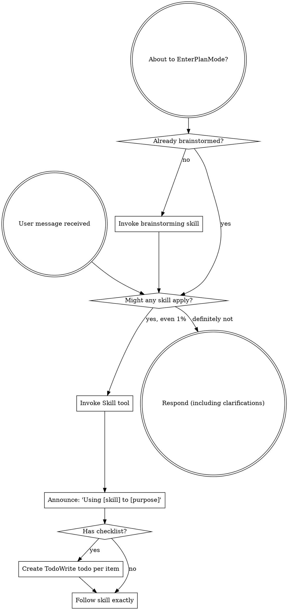

Reading additional input from stdin...
OpenAI Codex v0.135.0
--------
workdir: C:\Repo\ufdr-analyzer
model: gpt-5.5
provider: openai
approval: never
sandbox: read-only
reasoning effort: xhigh
reasoning summaries: none
session id: 019ea8a9-c253-7bf2-b34a-c55b8711374e
--------
user
review this diff as a senior engineer with no patience for excuses. Forensic tool. Feature 1: RFC 3161 trusted timestamping of an audit-chain head hash (build TimeStampReq, parse TimeStampResp, verify message imprint). Feature 2: voice-note transcription via faster-whisper persisting transcripts + audit events. Find security holes (timestamp verification gaps — note we deliberately defer full X.509 chain validation, flag if that's dangerous), determinism, injection, fail-loud violations (any silent skip of audio/evidence is unacceptable), race conditions, naming smell, dead code. Be brutal. No praise.

<stdin>
diff --git a/backend/db_setup.py b/backend/db_setup.py
index 04914b5..becc1bf 100644
--- a/backend/db_setup.py
+++ b/backend/db_setup.py
@@ -158,6 +158,25 @@ class EntityIndex(SQLModel, table=True):
     occurrence_count: int = 0
 
 
+class Transcript(SQLModel, table=True):
+    """Transcription of an audio media item (voice note) from a UFDR.
+
+    Audio messages are invisible to a text query layer until transcribed. Each
+    transcript links back to its source audio (`media_id`) and carries a content
+    hash so the transcription is itself auditable (an audit event records
+    audio_file_id + model + timestamp + transcript_hash).
+    """
+    id: Optional[uuid.UUID] = Field(
+        default_factory=uuid.uuid4, primary_key=True)
+    run_id: uuid.UUID = Field(index=True)
+    media_id: uuid.UUID = Field(index=True)  # the source audio Media.id
+    model: str  # e.g. "faster-whisper/base"
+    language: Optional[str] = None
+    text: str = Field(sa_column=Column(TEXT))
+    transcript_hash: str = Field(index=True)  # sha256 of the transcript text
+    created_at: datetime.datetime = Field(default_factory=datetime.datetime.utcnow)
+
+
 class Message(SQLModel, table=True):
     """Represents a message from UFDR data."""
     id: Optional[uuid.UUID] = Field(
diff --git a/backend/ingest/routers/audit_router.py b/backend/ingest/routers/audit_router.py
index 41658d6..9424ce8 100644
--- a/backend/ingest/routers/audit_router.py
+++ b/backend/ingest/routers/audit_router.py
@@ -31,6 +31,57 @@ def get_audit(session: Session = Depends(get_session)) -> dict:
     return audit_service.export(session)
 
 
+@router.post("/timestamp")
+def timestamp_chain(session: Session = Depends(get_session)) -> dict:
+    """Anchor the current audit-chain head to an RFC 3161 TSA token.
+
+    The custody root (chain head hash) is sent to an external Time-Stamp
+    Authority; its token independently attests the head existed at a UTC instant.
+    On any TSA failure we record the exact reason in the chain and raise — we
+    never return an unstamped result dressed up as stamped.
+    """
+    from ingest.services.timestamp_service import (
+        DEFAULT_TSA_URL, TimestampError, request_timestamp,
+    )
+
+    head_hash = audit_service.export(session)["head_hash"]
+    tsa_url = os.getenv("TSA_URL", DEFAULT_TSA_URL)
+    try:
+        digest = bytes.fromhex(head_hash)
+    except ValueError as e:
+        raise HTTPException(status_code=500, detail=f"invalid chain head hash: {e}")
+
+    try:
+        token = request_timestamp(digest, tsa_url=tsa_url)
+    except TimestampError as e:
+        # Record the failure (exact reason) in the tamper-evident chain, then fail.
+        audit_service.record(
+            session, "timestamp_failed",
+            payload={"tsa_url": tsa_url, "head_hash": head_hash, "reason": str(e)},
+        )
+        raise HTTPException(status_code=502, detail=str(e))
+
+    event = audit_service.record(
+        session, "timestamp",
+        payload={
+            "tsa_url": token.tsa_url,
+            "head_hash": head_hash,
+            "gen_time": token.gen_time,
+            "serial_number": token.serial_number,
+            "policy": token.policy,
+            "token_b64": token.token_b64(),
+        },
+    )
+    return {
+        "stamped_head_hash": head_hash,
+        "tsa_url": token.tsa_url,
+        "gen_time": token.gen_time,
+        "serial_number": token.serial_number,
+        "policy": token.policy,
+        "audit_event_seq": event.seq,
+    }
+
+
 @router.get("/verify")
 def verify_audit(session: Session = Depends(get_session)) -> dict:
     status = audit_service.verify_chain(session)
diff --git a/backend/ingest/routers/transcription_router.py b/backend/ingest/routers/transcription_router.py
new file mode 100644
index 0000000..8bee54b
--- /dev/null
+++ b/backend/ingest/routers/transcription_router.py
@@ -0,0 +1,41 @@
+"""Voice-note transcription endpoints."""
+import uuid
+
+from fastapi import APIRouter, Depends, HTTPException, Query
+from sqlmodel import Session, select
+
+from database import get_session
+from db_setup import Transcript
+from ingest.services.audit_service import audit_service
+from ingest.services.transcription_service import TranscriptionService
+
+router = APIRouter(prefix="/transcription", tags=["Voice-note Transcription"])
+
+
+@router.post("/run")
+def transcribe_run(run_id: uuid.UUID = Query(...), session: Session = Depends(get_session)) -> dict:
+    """Transcribe every audio item in a run; persist + audit each transcript.
+
+    Uses the default faster-whisper transcriber, which fails loudly if the model
+    package is not installed (audio is never silently skipped)."""
+    try:
+        results = TranscriptionService().transcribe_run(session, run_id, audit_service=audit_service)
+    except ValueError as e:
+        raise HTTPException(status_code=404, detail=str(e))
+    return {"run_id": str(run_id), "transcribed": len(results),
+            "transcripts": [r.to_dict() for r in results]}
+
+
+@router.get("/run")
+def list_transcripts(run_id: uuid.UUID = Query(...), session: Session = Depends(get_session)) -> dict:
+    """List stored transcripts for a run."""
+    rows = session.exec(select(Transcript).where(Transcript.run_id == run_id)).all()
+    return {
+        "run_id": str(run_id),
+        "count": len(rows),
+        "transcripts": [
+            {"transcript_id": str(t.id), "media_id": str(t.media_id), "model": t.model,
+             "language": t.language, "text": t.text, "transcript_hash": t.transcript_hash}
+            for t in rows
+        ],
+    }
diff --git a/backend/ingest/services/timestamp_service.py b/backend/ingest/services/timestamp_service.py
new file mode 100644
index 0000000..293bc0d
--- /dev/null
+++ b/backend/ingest/services/timestamp_service.py
@@ -0,0 +1,166 @@
+"""RFC 3161 trusted timestamping of the custody root hash.
+
+V2's audit chain is tamper-evident but *locally* signed — anyone trusting it must
+trust this server. An RFC 3161 Time-Stamp Authority (TSA) is an independent third
+party that cryptographically attests "this digest existed at this UTC instant".
+Anchoring the audit-chain head to a TSA token makes the seal **independently
+verifiable**: a court can check the token against the TSA's public certificate
+without trusting us.
+
+No fallbacks (per project rule + V3 handoff): if the TSA is unreachable or
+rejects the request, we raise loudly with the exact reason. We NEVER return a
+"pretend it's stamped" result. The caller records the failure reason in the audit
+trail before surfacing the error.
+
+The HTTP transport is injectable (`poster`) so the request-building and
+response-parsing logic is fully unit-tested offline, without a live TSA.
+"""
+from __future__ import annotations
+
+import base64
+from dataclasses import dataclass
+from typing import Callable, Optional
+
+from asn1crypto import algos, cms, core, tsp
+
+# RFC 3161 marks `timeStampToken` OPTIONAL (absent on rejection), but some
+# asn1crypto builds omit that flag, which makes a real rejection response
+# unparseable. Restore the optional flag so rejections surface cleanly.
+for _i, _f in enumerate(tsp.TimeStampResp._fields):
+    if _f[0] == "time_stamp_token":
+        _opts = dict(_f[2]) if len(_f) > 2 else {}
+        _opts["optional"] = True
+        tsp.TimeStampResp._fields[_i] = (_f[0], _f[1], _opts)
+
+# freetsa.org is a free, no-auth RFC 3161 issuer. Override with TSA_URL.
+DEFAULT_TSA_URL = "https://freetsa.org/tsr"
+_GRANTED = {"granted", "granted_with_mods"}
+
+# Type of the injectable HTTP transport: (url, der_request, timeout) -> der_response
+Poster = Callable[[str, bytes, float], bytes]
+
+
+class TimestampError(RuntimeError):
+    """Raised loudly when a trusted timestamp cannot be obtained or verified."""
+
+
+@dataclass
+class TimestampToken:
+    token_der: bytes
+    gen_time: str          # ISO-8601 UTC instant attested by the TSA
+    serial_number: int
+    policy: Optional[str]
+    tsa_url: str
+    digest_hex: str        # the digest that was stamped (the custody root)
+
+    def token_b64(self) -> str:
+        return base64.b64encode(self.token_der).decode("ascii")
+
+
+def build_timestamp_request(digest: bytes, hash_algo: str = "sha256",
+                            nonce: Optional[int] = None, cert_req: bool = True) -> bytes:
+    """Build a DER-encoded RFC 3161 TimeStampReq for `digest`."""
+    if hash_algo == "sha256" and len(digest) != 32:
+        raise TimestampError(
+            f"sha256 message imprint must be 32 bytes, got {len(digest)}")
+    req = tsp.TimeStampReq({
+        "version": "v1",
+        "message_imprint": tsp.MessageImprint({
+            "hash_algorithm": algos.DigestAlgorithm({"algorithm": hash_algo}),
+            "hashed_message": core.OctetString(digest),
+        }),
+        "cert_req": cert_req,
+    })
+    if nonce is not None:
+        req["nonce"] = core.Integer(nonce)
+    return req.dump()
+
+
+def _default_poster(url: str, der_request: bytes, timeout: float) -> bytes:
+    import requests  # local import so the module loads without network deps
+    resp = requests.post(
+        url, data=der_request, timeout=timeout,
+        headers={"Content-Type": "application/timestamp-query",
+                 "Accept": "application/timestamp-reply"},
+    )
+    resp.raise_for_status()
+    return resp.content
+
+
+def request_timestamp(digest: bytes, tsa_url: str = DEFAULT_TSA_URL,
+                      nonce: Optional[int] = None, timeout: float = 15.0,
+                      poster: Poster = _default_poster) -> TimestampToken:
+    """Obtain a trusted timestamp token over `digest`. Raises loudly on any
+    failure (network, TSA rejection, malformed response, imprint mismatch)."""
+    der_req = build_timestamp_request(digest, nonce=nonce)
+    try:
+        der_resp = poster(tsa_url, der_req, timeout)
+    except Exception as e:  # network/transport failure — surface the exact cause
+        raise TimestampError(f"TSA request to {tsa_url} failed: {e!r}") from e
+
+    try:
+        resp = tsp.TimeStampResp.load(der_resp)
+    except Exception as e:
+        raise TimestampError(f"TSA returned an unparseable response: {e!r}") from e
+
+    status = resp["status"]["status"].native
+    if status not in _GRANTED:
+        fail_info = None
+        try:
+            fail_info = resp["status"]["fail_info"].native
+        except Exception:
+            pass
+        raise TimestampError(
+            f"TSA {tsa_url} rejected the request: status={status!r} fail_info={fail_info!r}")
+
+    token_ci = resp["time_stamp_token"]
+    if token_ci.native is None:
+        raise TimestampError(f"TSA {tsa_url} granted but returned no token")
+
+    token_der = token_ci.dump()
+    info = verify_timestamp(token_der, digest)   # also confirms imprint matches
+    info.tsa_url = tsa_url
+    return info
+
+
+def verify_timestamp(token_der: bytes, digest: bytes) -> TimestampToken:
+    """Parse a timestamp token and confirm its message imprint equals `digest`.
+
+    Verifies the binding between the token and the data (the custody root). Full
+    X.509 signature-chain validation against the TSA's CA is the verifier's job
+    at audit time and is intentionally out of scope here — documented, not faked.
+    """
+    try:
+        ci = cms.ContentInfo.load(token_der)
+        signed_data = ci["content"]
+        content = signed_data["encap_content_info"]["content"]
+        # asn1crypto maps the `tst_info` content type, so the octet string
+        # auto-parses to a TSTInfo via `.parsed`; otherwise load the raw bytes.
+        parsed = getattr(content, "parsed", None)
+        if isinstance(parsed, tsp.TSTInfo):
+            tst_info = parsed
+        else:
+            raw = content.native
+            tst_info = raw if isinstance(raw, tsp.TSTInfo) else tsp.TSTInfo.load(raw)
+    except Exception as e:
+        raise TimestampError(f"could not parse timestamp token: {e!r}") from e
+
+    stamped = tst_info["message_imprint"]["hashed_message"].native
+    if stamped != digest:
+        raise TimestampError(
+            "timestamp token does not match the data: message imprint mismatch")
+
+    policy = None
+    try:
+        policy = tst_info["policy"].native
+    except Exception:
+        pass
+
+    return TimestampToken(
+        token_der=token_der,
+        gen_time=tst_info["gen_time"].native.isoformat(),
+        serial_number=int(tst_info["serial_number"].native),
+        policy=str(policy) if policy is not None else None,
+        tsa_url="",
+        digest_hex=digest.hex(),
+    )
diff --git a/backend/ingest/services/transcription_service.py b/backend/ingest/services/transcription_service.py
new file mode 100644
index 0000000..df39411
--- /dev/null
+++ b/backend/ingest/services/transcription_service.py
@@ -0,0 +1,133 @@
+"""Voice-note transcription — make audio messages queryable.
+
+UFDR dumps contain audio messages that the text/IR query layer can't see. This
+service transcribes audio media (locally, via faster-whisper — no API key),
+persists each transcript linked to its source audio, records the transcription
+as an audit event (audio_file_id, model, timestamp, transcript_hash), and lets
+the caller index transcripts in Meilisearch alongside text.
+
+The transcriber is **injected** (`transcriber`), so the persistence + audit +
+indexing orchestration is fully testable without the heavy model. The default
+transcriber lazily loads faster-whisper and **fails loudly** if it isn't
+installed — never silently skipping audio (which would hide evidence).
+"""
+from __future__ import annotations
+
+import hashlib
+import logging
+from dataclasses import dataclass
+from pathlib import Path
+from typing import Callable, Optional
+
+from sqlmodel import Session, select
+
+from db_setup import Media, Run, Transcript
+
+logger = logging.getLogger(__name__)
+
+_AUDIO_EXTS = {".amr", ".3gp", ".m4a", ".mp3", ".ogg", ".opus", ".wav", ".aac", ".flac"}
+
+# transcriber(audio_path, model_size) -> {"text": str, "language": str|None, "model": str}
+Transcriber = Callable[[str, str], dict]
+
+
+@dataclass
+class TranscriptResult:
+    transcript_id: str
+    media_id: str
+    model: str
+    language: Optional[str]
+    text: str
+    transcript_hash: str
+
+    def to_dict(self) -> dict:
+        return self.__dict__
+
+
+def _is_audio(media: Media) -> bool:
+    if media.media_type and "audio" in media.media_type.lower():
+        return True
+    path = media.original_path or media.storage_path or ""
+    return Path(path).suffix.lower() in _AUDIO_EXTS
+
+
+def default_whisper_transcriber(audio_path: str, model_size: str = "base") -> dict:
+    """faster-whisper transcriber. Fails loudly if the package is absent."""
+    try:
+        from faster_whisper import WhisperModel
+    except ImportError as e:  # explicit, actionable — not a silent skip
+        raise RuntimeError(
+            "faster-whisper is not installed — cannot transcribe audio. "
+            "Install it (`pip install faster-whisper`) or inject a transcriber."
+        ) from e
+    model = WhisperModel(model_size, device="cpu", compute_type="int8")
+    segments, info = model.transcribe(audio_path)
+    text = " ".join(seg.text for seg in segments).strip()
+    return {"text": text, "language": info.language, "model": f"faster-whisper/{model_size}"}
+
+
+class TranscriptionService:
+    def __init__(self, transcriber: Optional[Transcriber] = None, model_size: str = "base"):
+        self._transcriber = transcriber or default_whisper_transcriber
+        self._model_size = model_size
+
+    def audio_media(self, session: Session, run_id) -> list[Media]:
+        media = session.exec(select(Media).where(Media.run_id == run_id)).all()
+        return [m for m in media if _is_audio(m)]
+
+    def transcribe_run(self, session: Session, run_id, audit_service=None,
+                       meili_client=None) -> list[TranscriptResult]:
+        """Transcribe every audio item in a run; persist + audit each.
+
+        Fails loud on a nonexistent run. Re-transcription replaces prior
+        transcripts for the same media (idempotent)."""
+        if session.get(Run, run_id) is None:
+            raise ValueError(f"run {run_id} does not exist")
+
+        results: list[TranscriptResult] = []
+        for media in self.audio_media(session, run_id):
+            path = media.storage_path or media.original_path
+            if not path:
+                raise RuntimeError(f"audio media {media.id} has no path to transcribe")
+
+            out = self._transcriber(path, self._model_size)
+            text = out["text"]
+            thash = hashlib.sha256(text.encode("utf-8")).hexdigest()
+
+            # Replace any prior transcript for this media (idempotent re-runs).
+            for old in session.exec(select(Transcript).where(Transcript.media_id == media.id)).all():
+                session.delete(old)
+
+            tr = Transcript(
+                run_id=run_id, media_id=media.id, model=out["model"],
+                language=out.get("language"), text=text, transcript_hash=thash,
+            )
+            session.add(tr)
+            session.commit()
+            session.refresh(tr)
+
+            if audit_service is not None:
+                audit_service.record(
+                    session, "transcription",
+                    payload={"audio_file_id": str(media.id), "model": out["model"],
+                             "transcript_hash": thash, "language": out.get("language")},
+                    run_id=run_id,
+                )
+
+            results.append(TranscriptResult(
+                transcript_id=str(tr.id), media_id=str(media.id), model=out["model"],
+                language=out.get("language"), text=text, transcript_hash=thash,
+            ))
+
+        if meili_client is not None and results:
+            self.index_transcripts(meili_client, run_id, results)
+        return results
+
+    def index_transcripts(self, meili_client, run_id, results: list[TranscriptResult]) -> None:
+        """Index transcripts in Meilisearch alongside text content."""
+        docs = [
+            {"id": r.transcript_id, "run_id": str(run_id), "media_id": r.media_id,
+             "text": r.text, "language": r.language, "model": r.model}
+            for r in results
+        ]
+        meili_client.index("transcripts").add_documents(docs)
</stdin>
hook: SessionStart
hook: SessionStart Failed
exec
"C:\\Users\\Aayushman\\AppData\\Local\\Microsoft\\WindowsApps\\pwsh.exe" -Command "Get-Content -Path 'C:/Users/Aayushman/.codex/plugins/cache/claude-plugins-official/superpowers/5.1.0/skills/using-superpowers/SKILL.md'" in C:\Repo\ufdr-analyzer
 succeeded in 405ms:
---
name: using-superpowers
description: Use when starting any conversation - establishes how to find and use skills, requiring Skill tool invocation before ANY response including clarifying questions
---

<SUBAGENT-STOP>
If you were dispatched as a subagent to execute a specific task, skip this skill.
</SUBAGENT-STOP>

<EXTREMELY-IMPORTANT>
If you think there is even a 1% chance a skill might apply to what you are doing, you ABSOLUTELY MUST invoke the skill.

IF A SKILL APPLIES TO YOUR TASK, YOU DO NOT HAVE A CHOICE. YOU MUST USE IT.

This is not negotiable. This is not optional. You cannot rationalize your way out of this.
</EXTREMELY-IMPORTANT>

## Instruction Priority

Superpowers skills override default system prompt behavior, but **user instructions always take precedence**:

1. **User's explicit instructions** (CLAUDE.md, GEMINI.md, AGENTS.md, direct requests) — highest priority
2. **Superpowers skills** — override default system behavior where they conflict
3. **Default system prompt** — lowest priority

If CLAUDE.md, GEMINI.md, or AGENTS.md says "don't use TDD" and a skill says "always use TDD," follow the user's instructions. The user is in control.

## How to Access Skills

**In Claude Code:** Use the `Skill` tool. When you invoke a skill, its content is loaded and presented to you—follow it directly. Never use the Read tool on skill files.

**In Copilot CLI:** Use the `skill` tool. Skills are auto-discovered from installed plugins. The `skill` tool works the same as Claude Code's `Skill` tool.

**In Gemini CLI:** Skills activate via the `activate_skill` tool. Gemini loads skill metadata at session start and activates the full content on demand.

**In other environments:** Check your platform's documentation for how skills are loaded.

## Platform Adaptation

Skills use Claude Code tool names. Non-CC platforms: see `references/copilot-tools.md` (Copilot CLI), `references/codex-tools.md` (Codex) for tool equivalents. Gemini CLI users get the tool mapping loaded automatically via GEMINI.md.

# Using Skills

## The Rule

**Invoke relevant or requested skills BEFORE any response or action.** Even a 1% chance a skill might apply means that you should invoke the skill to check. If an invoked skill turns out to be wrong for the situation, you don't need to use it.

## Red Flags

These thoughts mean STOP—you're rationalizing:

| Thought | Reality |
|---------|---------|
| "This is just a simple question" | Questions are tasks. Check for skills. |
| "I need more context first" | Skill check comes BEFORE clarifying questions. |
| "Let me explore the codebase first" | Skills tell you HOW to explore. Check first. |
| "I can check git/files quickly" | Files lack conversation context. Check for skills. |
| "Let me gather information first" | Skills tell you HOW to gather information. |
| "This doesn't need a formal skill" | If a skill exists, use it. |
| "I remember this skill" | Skills evolve. Read current version. |
| "This doesn't count as a task" | Action = task. Check for skills. |
| "The skill is overkill" | Simple things become complex. Use it. |
| "I'll just do this one thing first" | Check BEFORE doing anything. |
| "This feels productive" | Undisciplined action wastes time. Skills prevent this. |
| "I know what that means" | Knowing the concept ≠ using the skill. Invoke it. |

## Skill Priority

When multiple skills could apply, use this order:

1. **Process skills first** (brainstorming, debugging) - these determine HOW to approach the task
2. **Implementation skills second** (frontend-design, mcp-builder) - these guide execution

"Let's build X" → brainstorming first, then implementation skills.
"Fix this bug" → debugging first, then domain-specific skills.

## Skill Types

**Rigid** (TDD, debugging): Follow exactly. Don't adapt away discipline.

**Flexible** (patterns): Adapt principles to context.

The skill itself tells you which.

## User Instructions

Instructions say WHAT, not HOW. "Add X" or "Fix Y" doesn't mean skip workflows.

codex
Using `superpowers:using-superpowers` to satisfy the session workflow; for this turn I’m applying the requested senior code-review stance only.
codex
Block merge. This diff creates evidence-looking records that are not actually trustworthy.

**Findings**

- Critical — [timestamp_service.py:126](backend/ingest/services/timestamp_service.py:126): `verify_timestamp()` does not verify the CMS signature. It parses `TSTInfo` and compares the imprint, so a forged token with a matching digest passes.

- Critical — [timestamp_service.py:129](backend/ingest/services/timestamp_service.py:129): deferring full X.509 chain validation is dangerous as shipped. You also need TSA cert path, EKU `id-kp-timeStamping`, policy OID, validity, and revocation checks before calling this “trusted.”

- High — [audit_router.py:40](backend/ingest/routers/audit_router.py:40): audit head is read before a remote TSA call with no lock. Concurrent audit writes can move the chain while this request is in flight, so the recorded “current head” may no longer be current.

- High — [timestamp_service.py:90](backend/ingest/services/timestamp_service.py:90): no nonce is generated or verified. Even if caller passes one, `verify_timestamp()` ignores it.

- High — [timestamp_service.py:148](backend/ingest/services/timestamp_service.py:148): imprint bytes are checked, but hash algorithm, content type, signed attributes, signer count, policy, and cert inclusion are not checked.

- Critical — [transcription_service.py:105](backend/ingest/services/transcription_service.py:105): transcript is committed before the audit event. If audit recording fails, you now have unaudited derived evidence.

- Critical — [transcription_service.py:97](backend/ingest/services/transcription_service.py:97): reruns delete prior transcripts. Forensic derived evidence should be immutable; create a superseding version and audit that relation.

- Critical — [transcription_service.py:89](backend/ingest/services/transcription_service.py:89): falls back to `media.original_path`. UFDR metadata can be attacker-controlled. This risks arbitrary local file reads and unsafe decoder input. Only use sanitized extracted storage paths under the evidence root.

- Critical — [transcription_service.py:112](backend/ingest/services/transcription_service.py:112): audit event does not bind transcript to source audio bytes. `media.id` is not enough. Record source audio hash, size, and stable storage identity.

- High — [transcription_service.py:88](backend/ingest/services/transcription_service.py:88): transcription failures are not audited. Missing path, decoder failure, model failure, or bad output just raises, with no `transcription_failed` event and no rich context.

- High — [transcription_service.py:47](backend/ingest/services/transcription_service.py:47): audio discovery silently skips anything not matching a weak MIME/extension heuristic. Returning `transcribed: 0` can hide missed voice notes.

- High — [transcription_service.py:63](backend/ingest/services/transcription_service.py:63): faster-whisper is not pinned or recorded precisely. Model revision/hash, package versions, ffmpeg/decoder version, decode parameters, language confidence, and segment timings are missing.

- High — [transcription_service.py:98](backend/ingest/services/transcription_service.py:98): concurrent transcription runs race on delete/insert/audit for the same media. Add transaction boundaries, uniqueness constraints, and locking.

- Medium — [timestamp_service.py:109](backend/ingest/services/timestamp_service.py:109) and [timestamp_service.py:154](backend/ingest/services/timestamp_service.py:154): `except Exception: pass` violates the fail-loud rule. Malformed TSA fields should not be silently suppressed.

- Medium — [timestamp_service.py:36](backend/ingest/services/timestamp_service.py:36): defaulting to public FreeTSA plus arbitrary `TSA_URL` is not a trust model. Require configured TSA identity, expected policy, HTTPS, and response-size limits.

- Medium — [db_setup.py:159](backend/db_setup.py:159): `Transcript` has no foreign keys, no uniqueness constraint, and uses naive `datetime.utcnow`. That invites dangling rows, duplicates, and ambiguous timestamps.

- Medium — [transcription_service.py:133](backend/ingest/services/transcription_service.py:133): Meilisearch indexing does not wait for task completion. It can fail after the service reports success. Also the router never passes a Meili client, so this path is effectively dead in this diff.

- Low — naming is misleading: `verify_timestamp()` does not verify the timestamp, `TimestampToken` is not trusted, `audio_file_id` is actually a media id, and `transcript_hash` is only a text hash.

Minimum test bar before merge: forged unsigned timestamp token, wrong signature, wrong imprint, wrong nonce, wrong hash algorithm, invalid TSA cert, concurrent timestamping, transcription audit failure after DB write, rerun immutability, skipped/unknown audio media, and concurrent transcription of the same run.
tokens used
32,241
Block merge. This diff creates evidence-looking records that are not actually trustworthy.

**Findings**

- Critical — [timestamp_service.py:126](backend/ingest/services/timestamp_service.py:126): `verify_timestamp()` does not verify the CMS signature. It parses `TSTInfo` and compares the imprint, so a forged token with a matching digest passes.

- Critical — [timestamp_service.py:129](backend/ingest/services/timestamp_service.py:129): deferring full X.509 chain validation is dangerous as shipped. You also need TSA cert path, EKU `id-kp-timeStamping`, policy OID, validity, and revocation checks before calling this “trusted.”

- High — [audit_router.py:40](backend/ingest/routers/audit_router.py:40): audit head is read before a remote TSA call with no lock. Concurrent audit writes can move the chain while this request is in flight, so the recorded “current head” may no longer be current.

- High — [timestamp_service.py:90](backend/ingest/services/timestamp_service.py:90): no nonce is generated or verified. Even if caller passes one, `verify_timestamp()` ignores it.

- High — [timestamp_service.py:148](backend/ingest/services/timestamp_service.py:148): imprint bytes are checked, but hash algorithm, content type, signed attributes, signer count, policy, and cert inclusion are not checked.

- Critical — [transcription_service.py:105](backend/ingest/services/transcription_service.py:105): transcript is committed before the audit event. If audit recording fails, you now have unaudited derived evidence.

- Critical — [transcription_service.py:97](backend/ingest/services/transcription_service.py:97): reruns delete prior transcripts. Forensic derived evidence should be immutable; create a superseding version and audit that relation.

- Critical — [transcription_service.py:89](backend/ingest/services/transcription_service.py:89): falls back to `media.original_path`. UFDR metadata can be attacker-controlled. This risks arbitrary local file reads and unsafe decoder input. Only use sanitized extracted storage paths under the evidence root.

- Critical — [transcription_service.py:112](backend/ingest/services/transcription_service.py:112): audit event does not bind transcript to source audio bytes. `media.id` is not enough. Record source audio hash, size, and stable storage identity.

- High — [transcription_service.py:88](backend/ingest/services/transcription_service.py:88): transcription failures are not audited. Missing path, decoder failure, model failure, or bad output just raises, with no `transcription_failed` event and no rich context.

- High — [transcription_service.py:47](backend/ingest/services/transcription_service.py:47): audio discovery silently skips anything not matching a weak MIME/extension heuristic. Returning `transcribed: 0` can hide missed voice notes.

- High — [transcription_service.py:63](backend/ingest/services/transcription_service.py:63): faster-whisper is not pinned or recorded precisely. Model revision/hash, package versions, ffmpeg/decoder version, decode parameters, language confidence, and segment timings are missing.

- High — [transcription_service.py:98](backend/ingest/services/transcription_service.py:98): concurrent transcription runs race on delete/insert/audit for the same media. Add transaction boundaries, uniqueness constraints, and locking.

- Medium — [timestamp_service.py:109](backend/ingest/services/timestamp_service.py:109) and [timestamp_service.py:154](backend/ingest/services/timestamp_service.py:154): `except Exception: pass` violates the fail-loud rule. Malformed TSA fields should not be silently suppressed.

- Medium — [timestamp_service.py:36](backend/ingest/services/timestamp_service.py:36): defaulting to public FreeTSA plus arbitrary `TSA_URL` is not a trust model. Require configured TSA identity, expected policy, HTTPS, and response-size limits.

- Medium — [db_setup.py:159](backend/db_setup.py:159): `Transcript` has no foreign keys, no uniqueness constraint, and uses naive `datetime.utcnow`. That invites dangling rows, duplicates, and ambiguous timestamps.

- Medium — [transcription_service.py:133](backend/ingest/services/transcription_service.py:133): Meilisearch indexing does not wait for task completion. It can fail after the service reports success. Also the router never passes a Meili client, so this path is effectively dead in this diff.

- Low — naming is misleading: `verify_timestamp()` does not verify the timestamp, `TimestampToken` is not trusted, `audio_file_id` is actually a media id, and `transcript_hash` is only a text hash.

Minimum test bar before merge: forged unsigned timestamp token, wrong signature, wrong imprint, wrong nonce, wrong hash algorithm, invalid TSA cert, concurrent timestamping, transcription audit failure after DB write, rerun immutability, skipped/unknown audio media, and concurrent transcription of the same run.
